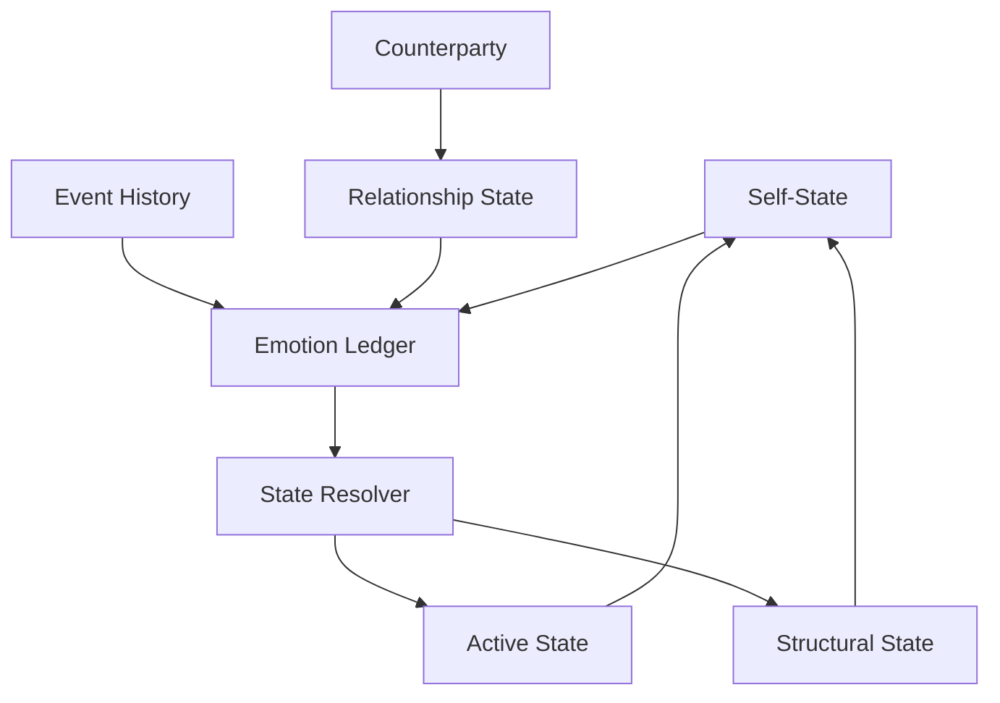

# State Model Overview

This page explains the major persistent state objects in the architecture and how they differ from one another.

## Purpose

Define the main state containers used by the system before introducing the processing flow that acts on them.

## Core Idea

The architecture depends on the idea that not all state is the same. Some state belongs to the system as a whole, while some state belongs to the system’s relationship with a specific counterparty. Keeping these layers separate makes the model more explainable and prevents important distinctions from being lost.

At the highest level, the model contains a persistent **self-state** and a persistent **relationship state** for each counterparty. The self-state represents the system’s overall affective condition. A relationship state represents how the system currently relates to one specific counterparty. Together, these allow the system to distinguish between “how I generally am right now” and “how I currently relate to this particular counterparty.”

This distinction matters because interactions do not always affect the system in the same way. An event may primarily change one relationship, such as lowering trust toward a particular counterparty. A different event may change the self-state more broadly, such as increasing general stress or caution. Some events do both. By separating the state model into clear scopes, the architecture can track where an effect belongs and explain how local effects become global ones.

## Visual Overview

## Main State Objects

### Self-State

The self-state is the persistent global internal state of the system. It captures the system’s overall condition independent of any one counterparty. It may include active affective variables, long-term structural shifts, and general readiness states such as stress, calm, curiosity, caution, or self-regard.

The self-state answers questions like:
- What is the system’s general condition right now?
- What affects how it approaches any new interaction?
- What broader emotional residue has been carried over from prior history?

### Relationship State

A relationship state is the persistent state linking the system to one specific counterparty. It captures how the system currently relates to that counterparty rather than how it feels in general.

A relationship state may include dimensions such as:
- trust
- familiarity
- warmth
- caution
- salience
- respect
- expected reciprocity

The relationship state answers questions like:
- How does the system currently relate to this counterparty?
- What does it expect from them?
- How much does this relationship matter?
- How should past interactions with this counterparty shape current interpretation?

### Future Optional Scopes

The architecture may later include additional scoped state objects if needed, such as:
- topic-specific state
- session-specific state
- group-specific state
- role-specific state

These are not required for the initial model, but the state architecture should leave room for them. The main design rule is that each scope must exist for a clear reason and must be distinguishable from self-state and relationship state.

## Why the Separation Matters

Without separate state scopes, the model would blur together effects that should remain distinct.

For example:
- “I distrust counterparty A” is not the same as “I distrust people in general.”
- “I am stressed overall” is not the same as “I feel tense only with counterparty B.”
- “I am calm right now” is not the same as “this relationship has healed.”

A scoped state model makes it possible to attribute effects correctly. It also allows the system to explain when a relationship-specific event stayed local and when it spilled over into broader self-state.

## Active State and Structural State

Both self-state and relationship state can contain two different layers:

### Active state
The current emotionally active condition, derived from recent and still-relevant ledger contributions.

### Structural state
Longer-term learned changes that remain even after active emotion has faded.

For example:
- active irritation may fade after time passes
- lowered trust may remain as a structural change in the relationship state

This distinction will matter later when the state resolver is introduced.

## State Boundaries

A well-formed state model should always answer:
- What does this state belong to?
- What kind of state is it?
- How long does it persist?
- What kinds of events can affect it?
- Can it affect other scopes?

These boundary questions are essential for later pages on spillover, interpretation, and auditability.

## How It Connects

The next pages define each core state object in more detail:
- **Self-State** explains the global state of the system.
- **Counterparty** defines the external actor to which relationship state attaches.
- **Relationship State** explains the scoped relational model for each counterparty.

---
**Previous:** [Core Architectural Principles](04-core-architectural-principles.md)  
**Next:** [Self-State](06-self-state.md)  
**Related:** [Counterparty](07-counterparty.md), [Relationship State](08-relationship-state.md), [Open Design Questions](37-open-design-questions.md), [Visualization Index](visualizations.md)
