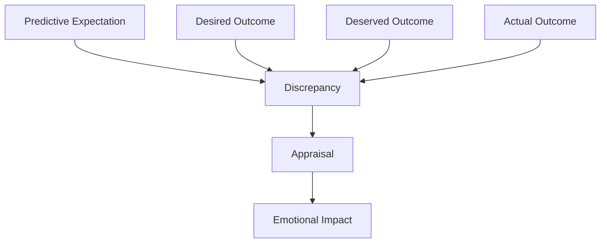

# Expectation Framework Overview

This page explains why expectation is central to emotional impact in the architecture.

## Purpose

Introduce the expectation layer that sits between raw events and emotional consequences.

## Core Idea

The architecture assumes that events do not produce emotional impact by themselves. Emotional impact comes from the relationship between an event’s actual outcome and the expectations that were active when the event occurred.

This means the system does not only ask:

- what happened?

It also asks:
- what did I think would happen?
- what did I want to happen?
- what did I believe should happen?
- how confident was I?
- how important was that outcome to me?

The answers to these questions determine whether an event feels neutral, surprising, disappointing, affirming, unfair, threatening, or deeply significant.

## Visual Overview

## Why Expectation Matters

The same event can have very different consequences depending on the expectations that preceded it.

For example, if a counterparty does not laugh at a joke:
- there may be little impact if no laughter was expected
- there may be mild disappointment if laughter was hoped for
- there may be embarrassment if laughter was strongly expected
- there may be hurt or anger if laughter was also felt to be deserved as a form of acknowledgment

This is why the framework does not treat emotion as a simple reaction to events. It treats emotion as a reaction to discrepancies between expectation and actual outcome.

## Main Expectation Types

The model distinguishes at least three expectation types.

### Predictive expectation
What the system thinks is likely to happen.

### Desired outcome
What the system wants to happen.

### Deserved outcome
What the system believes should happen.

These are not always the same. The system may predict a poor outcome while still believing it deserved a better one. That difference matters for emotional interpretation.

## Expectation Modifiers

Expectations are not binary. Their emotional force depends on additional factors such as:
- confidence
- importance
- rigidity
- source of the expectation
- connection to self-regard, fairness, or belonging

These modifiers help explain why some unmet expectations cause little disruption while others have major effects.

## From Expectation to Discrepancy

Once an actual outcome is identified, the system compares it to the active expectations. The resulting gap is called discrepancy. Discrepancy is the immediate bridge between expectation and appraisal.

The expectation framework therefore provides the foundation for later pages on:
- discrepancy
- appraisal
- emotional impact
- reflection
- expectation revision

## Why This Layer Improves Explainability

The expectation framework allows the system to explain not only what affected it, but why that event had the meaning it did.

Instead of saying:
- “this made me feel bad”

the system can say:
- “I expected warmth with high confidence”
- “I believed acknowledgment should happen”
- “the actual outcome violated both of those expectations”
- “that is why the emotional impact was strong”

This is one of the main reasons expectation is central to the architecture.

## How It Connects

The next pages define expectation itself and then break it into predictive expectation, desired outcome, deserved outcome, and the modifiers that determine expectation strength.

---
**Previous:** [Event History](10-event-history.md)  
**Next:** [Expectation](12-expectation.md)  
**Related:** [Discrepancy](17-discrepancy.md), [Appraisal](18-appraisal.md), [Reflective Review](29-reflective-review.md)
