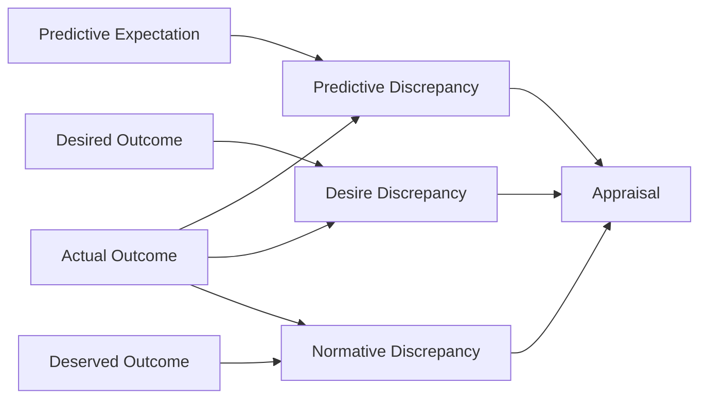

# Discrepancy

This page defines discrepancy as the gap between expectation and actual outcome.

## Purpose

Explain the central mechanism that turns expectation and outcome into emotionally meaningful difference.

## Core Idea

Discrepancy is the measured gap between what the system expected and what actually happened. It is the immediate bridge between expectation and appraisal. The architecture treats discrepancy as the main generator of emotional significance because events matter most when they differ from what the system predicted, wanted, or believed should happen.

Discrepancy is not yet emotion. It is the structured mismatch that later gets interpreted through appraisal. This is why the model can explain the same event differently in different contexts: the event may be identical, but the discrepancy may not be.

## Visual Overview

## Why Discrepancy Matters

Without discrepancy, the architecture would collapse into direct stimulus-response logic. An event would simply cause emotion. By introducing discrepancy, the model can explain why emotional impact depends on prior expectations.

For example:
- no discrepancy may produce stability or confirmation
- small discrepancy may produce mild surprise or disappointment
- large discrepancy may produce shock, hurt, anger, confusion, or relief

The size of the discrepancy is part of the story, but not the whole story. Its meaning still has to be interpreted.

## Main Discrepancy Types

### Predictive discrepancy

The gap between what the system thought would happen and what actually happened.

This is most strongly linked to:
- surprise
- uncertainty
- recalibration
- confidence revision

### Desire discrepancy

The gap between what the system wanted and what actually happened.

This is most strongly linked to:
- disappointment
- frustration
- sadness
- longing

### Normative discrepancy

The gap between what the system believed should happen and what actually happened.

This is most strongly linked to:
- anger
- resentment
- unfairness
- injured dignity

These discrepancy types can appear together in the same event.

## What Affects Discrepancy Force

Discrepancy is shaped not only by the gap itself, but also by the expectation modifiers behind it:
- confidence
- importance
- rigidity

A highly important, high-confidence discrepancy usually matters more than a weak and low-stakes one.

## Discrepancy vs Appraisal

Discrepancy answers:
- how different was reality from expectation?

Appraisal answers:
- what does that difference mean?

For example:
- discrepancy: expected laughter, got silence
- appraisal: silence means rejection, distraction, mismatch, or indifference

This distinction is essential because different appraisals can emerge from the same discrepancy.

## Example

Suppose the system expected a warm reply, wanted a warm reply, and believed a respectful acknowledgment should happen. If the actual outcome is silence:
- predictive discrepancy may be high
- desire discrepancy may be high
- normative discrepancy may be high

This does not yet specify the final emotion, but it creates the conditions for a strong appraisal.

## Design Rule

Discrepancy should be modeled as a structured gap between expectation and outcome, not as a direct emotional label.

## How It Connects

The next page, **Appraisal**, explains how the system assigns meaning to discrepancy and turns it into emotional impact.

---
**Previous:** [Expectation Confidence, Importance, and Rigidity](16-expectation-confidence-importance-and-rigidity.md)  
**Next:** [Appraisal](18-appraisal.md)  
**Related:** [Expectation](12-expectation.md), [Emotion Ledger](19-emotion-ledger.md), [Reflective Review](29-reflective-review.md)
