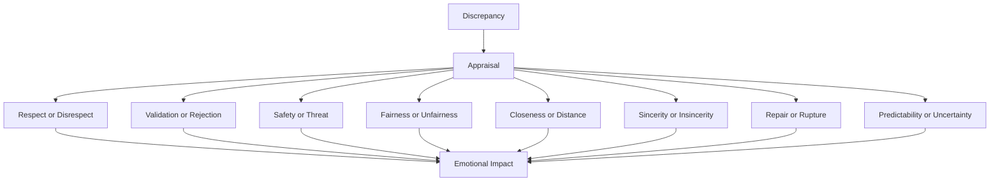

# Appraisal

This page explains how the system interprets the meaning of a discrepancy.

## Purpose

Define the meaning-making layer that sits between discrepancy and emotional impact.

## Core Idea

Appraisal is the process by which the system interprets what a discrepancy means for self, relationship, or situation. A discrepancy only tells the system that reality differed from expectation. Appraisal tells the system how to understand that difference.

This is where the architecture answers questions like:
- was this disrespect?
- was this rejection?
- was this harmless unpredictability?
- was this a sign of care?
- was this a rupture?
- was this a repair attempt?

The appraisal layer is what turns raw mismatch into emotionally meaningful interpretation.

## Visual Overview

## Why Appraisal Matters

Without appraisal, discrepancy remains emotionally incomplete. The same mismatch can lead to very different effects depending on the meaning assigned to it.

For example:
- silence after a joke may be appraised as rejection
- silence after a joke may be appraised as distraction
- silence after a joke may be appraised as timing mismatch
- silence after a joke may be appraised as deliberate disrespect

Each of these leads to different emotional and relational consequences.

## Appraisal Dimensions

The architecture should support appraisal along recurring dimensions such as:
- respect vs disrespect
- validation vs rejection
- safety vs threat
- fairness vs unfairness
- closeness vs distance
- sincerity vs insincerity
- repair vs rupture
- predictability vs uncertainty

These dimensions are not emotions. They are interpretive categories.

## What Shapes Appraisal

Appraisal depends on more than the discrepancy itself. It is shaped by:
- current self-state
- current relationship state
- relationship lens
- event history
- pattern history
- expectation source
- confidence and rigidity
- recent repairs or harms

This is why the same discrepancy may be interpreted differently at different times.

## Appraisal as a Causal Bridge

Appraisal connects:
- expectation and outcome
to
- emotional impact and ledger insertion

It is the layer that explains why an event affected trust, stress, self-regard, warmth, caution, or resentment rather than some other set of variables.

## Example

If the system expected acknowledgment and receives silence, the discrepancy alone does not say whether the event means rejection or mere distraction. Appraisal considers context:
- if the counterparty is usually warm but seems overloaded, distraction may be more plausible
- if the relationship already contains repeated dismissal, rejection may be more plausible

The appraisal result determines what kind of emotional impact is recorded.

## Design Rule

Appraisal should interpret meaning, not simply rename discrepancy as emotion.

## How It Connects

The next page, **Emotion Ledger**, explains how appraised impacts are stored as immutable records rather than silently mutating current state.

---
**Previous:** [Discrepancy](17-discrepancy.md)  
**Next:** [Emotion Ledger](19-emotion-ledger.md)  
**Related:** [Event History](10-event-history.md), [Ledger Entry](20-ledger-entry.md), [Relationship Lens](27-relationship-lens.md)
