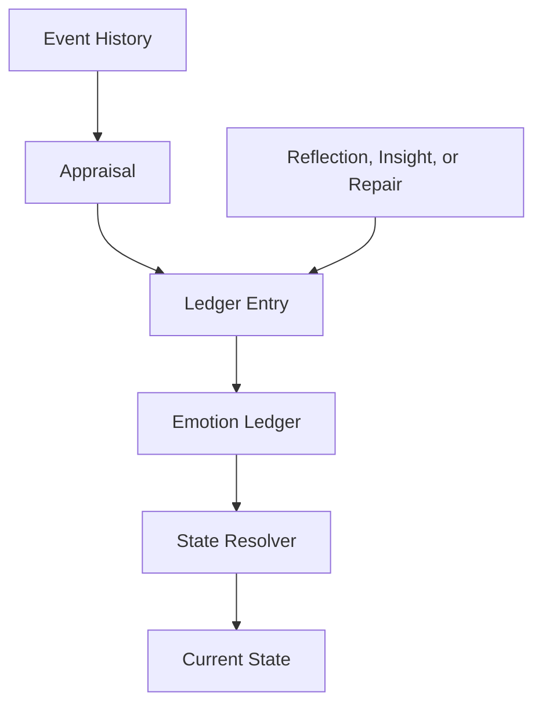

# Emotion Ledger

This page explains the append-only ledger model used to record emotionally meaningful impacts.

## Purpose

Show why emotional history should be preserved as immutable records rather than hidden inside opaque mutable state.

## Core Idea

The emotion ledger is an append-only record of emotionally meaningful impacts and adjustments. Instead of directly overwriting current emotional state, the architecture records what affected the system, when it happened, where it applied, and why it mattered. The present state is then derived from this history rather than treated as a hidden mutable truth.

This is one of the defining design choices of the architecture. The ledger preserves emotional causality over time.

## Visual Overview

## Why Use a Ledger

A ledger model provides several important advantages:

- **auditability** — current state can be traced back to specific causes  
- **explainability** — the system can answer why it feels a certain way  
- **historical honesty** — later reinterpretation does not erase earlier impact  
- **replayability** — reflection can revisit history without losing the original record  
- **separation of history from present state** — what happened is preserved even if its current influence changes  

Without a ledger, the model risks collapsing into a simple mutable mood tracker.

## Append-Only Principle

The ledger should be append-only. This means:
- existing entries are not silently rewritten
- reinterpretation creates new entries instead of changing old ones
- repair adds new records
- insight adds new records
- reflection adds new records

This allows the system to preserve both:
- what it originally felt
- how later understanding changed that feeling

## What the Ledger Stores

The ledger stores emotional consequences, not just events.

For example:
- an event history record may say that a counterparty remained silent
- the emotion ledger may record disappointment, reduced trust, increased caution, or later relief after reinterpretation

The ledger is therefore a history of emotional accounting rather than a raw event timeline.

## Ledger as Source of Truth

In this architecture, the ledger is the source of truth for emotional history. Current feeling is not the source of truth. It is a derived result.

This matters because the present state changes with time, decay, repair, and reflection, but the history of what affected the system should remain inspectable.

## Kinds of Ledger Entries

The ledger may contain entries produced by:
- live interaction processing
- relationship updates
- self-state updates
- pattern consolidation
- echo processing
- insight generation
- repair processing
- integration processing

Each entry records one causal contribution to later state.

## Example

A counterparty’s dismissive response may produce:
- a relationship-state entry reducing trust
- a relationship-state entry increasing caution
- a self-state entry increasing stress

Later reflection may add:
- a new entry reducing anger because the event is reinterpreted as distraction
- a new entry increasing sadness because the system realizes the relationship mattered more than it first admitted

Nothing is erased. New understanding is added.

## Design Rule

The ledger should preserve emotional history as insert-only causality. It should not be used as a place to store present state directly.

## How It Connects

The next page, **Ledger Entry**, defines what one immutable record in the ledger should contain.

---
**Previous:** [Appraisal](18-appraisal.md)  
**Next:** [Ledger Entry](20-ledger-entry.md)  
**Related:** [Event History](10-event-history.md), [State Resolver](21-state-resolver.md), [Explainability and Auditability](34-explainability-and-auditability.md)
