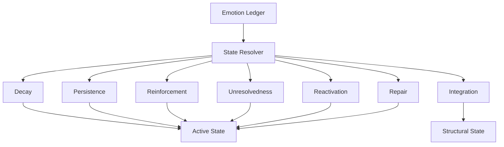

# State Resolver

This page explains how current state is derived from ledger history.

## Purpose

Define the read-time mechanism that turns immutable emotional records into present active state.

## Core Idea

The state resolver is the mechanism that reads the emotion ledger and derives the current state of the system. It does not simply sum all historical entries. Instead, it evaluates how much each entry still contributes in the present, taking into account factors such as time, persistence, reinforcement, unresolvedness, reactivation potential, repair, and integration.

This is what allows the architecture to separate:
- what affected the system historically
from
- what is still active now

## Visual Overview

## Why a Resolver Is Needed

The ledger preserves history, but the system still needs a way to answer:
- what do I feel right now?
- what is active in this relationship right now?
- what has faded?
- what still matters structurally?

A simple running total would not be enough, because emotional influence changes over time and context. The resolver exists to compute present truth from preserved history.

## What the Resolver Does

The resolver reads ledger entries and estimates their current contribution based on factors such as:
- recency
- decay
- persistence
- reinforcement
- unresolvedness
- repair
- integration
- current contextual relevance

This means that the same ledger entry may have:
- strong influence shortly after insertion
- weaker influence later
- renewed influence if reactivated
- reduced influence after repair or reflection

## Resolver vs Ledger

The ledger stores history.

The resolver computes present state.

This distinction is essential. The architecture should not confuse historical record with current activation.

## Active State and Structural State

The resolver may need to derive at least two kinds of outputs:

### Active state
What is emotionally alive right now.

### Structural state
What longer-term changes remain even after immediate activation fades.

This allows the system to distinguish between:
- “I am not actively upset now”
and
- “this relationship still carries lower trust”

## Why This Improves Explainability

Because current state is derived rather than overwritten, the system can explain:
- which entries are still active
- which have largely decayed
- which were softened by repair
- which remain structurally important

This makes the model much more transparent than a simple mutable state object.

## Example

A sharp negative entry may contribute strongly at first, then weaken over time. If related negative events recur, reinforcement may keep it active. If repair occurs, the active contribution may shrink even though the entry remains in history.

The resolver therefore gives the system a way to honor both emotional history and emotional change.

## Design Rule

The resolver should estimate current influence, not rewrite historical facts.

## How It Connects

The next pages expand the resolver’s main distinctions: active state versus structural state, then the temporal mechanics of decay, persistence, and reactivation.

---
**Previous:** [Ledger Entry](20-ledger-entry.md)  
**Next:** [Active State vs Structural State](22-active-state-vs-structural-state.md)  
**Related:** [Emotion Ledger](19-emotion-ledger.md), [Decay, Persistence, and Reactivation](23-decay-persistence-and-reactivation.md), [Integration and Repair](31-integration-and-repair.md)
