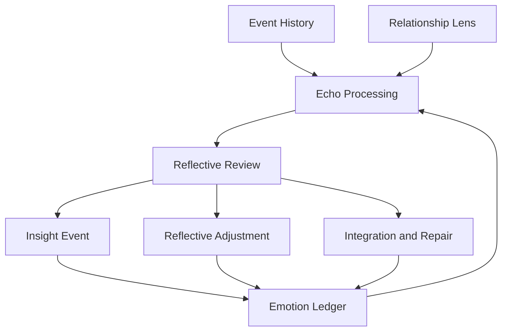

# Reflection and Echo Processing Overview

This page introduces the reflection framework and explains why past material is revisited later.

## Purpose

Provide an overview of the architecture’s replay and reinterpretation layer before the deeper pages on echo processing, relationship lens, insight, and adaptive processing.

## Core Idea

The architecture does not assume that all emotional meaning is settled at the moment an event first occurs. Some events are ambiguous, under-processed, emotionally intense, or only fully understandable in light of later context. For this reason, the system includes a reflection framework that can revisit earlier events and ledger entries after the fact.

This reflection framework includes two closely related ideas:

- **echo processing**, which replays past material
- **structured reflection**, which examines it in a more deliberate and interpretive way

Together, these allow the system to reconsider the past without rewriting it.

## Visual Overview

## Why Replay Matters

A later replay can reveal things that were not visible at the time of the original event.

For example:
- a comment once felt insulting, but later seems playful
- a small moment once seemed trivial, but later appears emotionally important
- a repeated pattern makes an older event newly meaningful
- a later apology changes how an earlier rupture is understood

Without replay, the system can react, but it cannot truly reflect.

## Why Reflection Matters

Replay alone is not enough. The architecture also needs a way to examine:
- what expectation was active
- why that expectation existed
- how the event was interpreted
- whether that interpretation was too rigid, too narrow, or outdated
- what healthier or more accurate alternatives are available

This is the job of structured reflection.

## Echo Processing vs Structured Reflection

These should remain distinct.

### Echo processing
A replay of prior material under current context.

### Structured reflection
A more deliberate review of expectation chains, interpretation chains, and emotional consequences.

Echo processing may simply make old material emotionally active again. Structured reflection tries to understand it better.

## What Reflection Can Produce

Reflection and echo processing may lead to:
- reactivation
- reinterpretation
- insight events
- repair recognition
- expectation revision
- integration
- reflective adjustments

These processes are central to the architecture’s idea of growth without hidden rewriting.

## Why This Matters for Explainability

The reflection framework allows the system to answer questions such as:
- why did my feeling about this old event change?
- why does this event matter more now than it did then?
- what new context changed its meaning?
- what belief made this event feel so damaging?
- what more adaptive interpretation is now possible?

That is one of the main strengths of the architecture.

## Design Rule

Reflection should add understanding, not erase historical fact.

## How It Connects

The next pages define the major parts of the reflection framework:
- **Echo Processing**
- **Relationship Lens**
- **Insight Events**
- **Reflective Review**
- **Reflective Adjustments**
- **Integration and Repair**

---
**Previous:** [Pattern Detection and Consolidation](24-pattern-detection-and-consolidation.md)  
**Next:** [Echo Processing](26-echo-processing.md)  
**Related:** [Relationship Lens](27-relationship-lens.md), [Insight Events](28-insight-events.md), [Reflective Review](29-reflective-review.md), [Visualization Index](visualizations.md)
