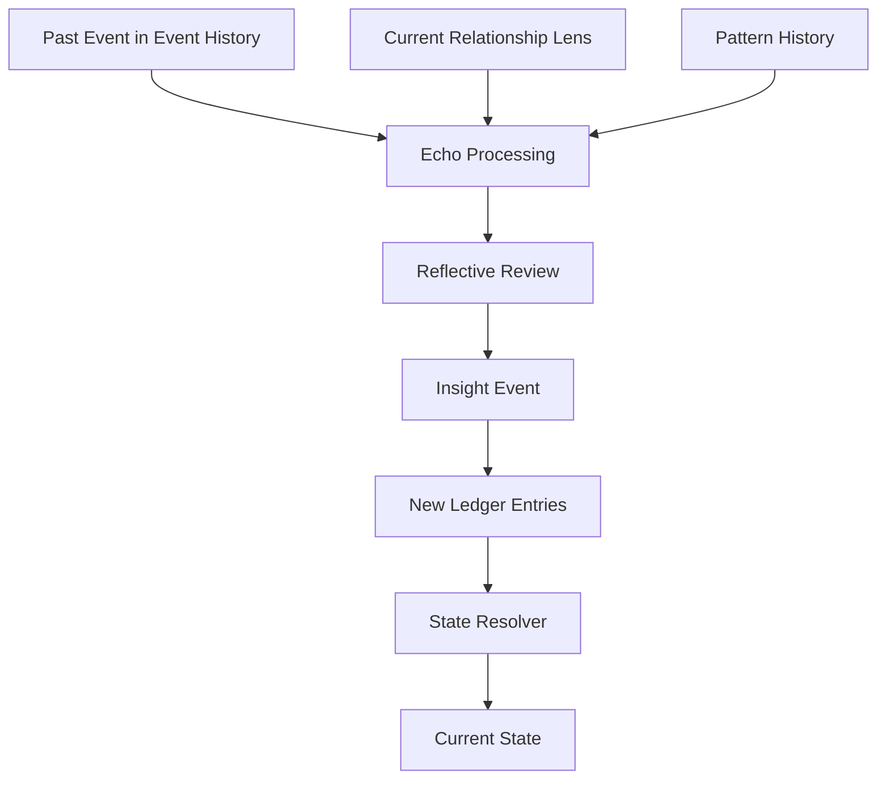

# Insight Events

This page defines new events generated when later understanding changes the meaning of earlier material.

## Purpose

Explain how reinterpretation becomes part of the architecture without rewriting history.

## Core Idea

An insight event is a new event generated when reflection, replay, or pattern recognition leads to a meaningful change in how an earlier event is understood. It is not the original event and it is not a silent correction. It is a new occurrence in the system’s causal history.

This is how the architecture preserves both continuity and reinterpretation at the same time.

## Visual Overview

## Why Insight Events Matter

Without insight events, the system could still change its mind, but it would be hard to explain when that change happened or why. Insight events make reinterpretation explicit.

They allow the system to say:
- “At first I understood this event one way”
- “Later I developed a new understanding”
- “That new understanding changed my present state”

This is one of the main advantages of the ledger model.

## What Can Produce an Insight Event

Insight events may be triggered by:
- echo processing
- changed relationship lens
- pattern consolidation
- repair recognition
- new contextual information
- reflective review
- changes in self-state that allow deeper understanding

## Types of Insight

Insight events can take several forms.

### Softening insight
A past harm now seems less harsh than it first appeared.

### Darkening insight
A past event now appears more concerning than it first seemed.

### Deepening insight
A past event now seems more emotionally important than it first appeared.

### Pattern insight
A past event now makes sense as part of a repeated structure.

### Repair insight
A past rupture now seems partly healed in light of later behavior.

These are not rigid categories, but they help show the range of reinterpretation the model can support.

## Insight Events and the Ledger

Insight events do not overwrite prior ledger entries. Instead, they generate new ledger entries that reflect the new understanding.

This preserves:
- original impact
- later reinterpretation
- present resolved state

The system can then explain both what it first felt and what later changed.

## Example

An initially painful comment may later be understood as awkward concern rather than contempt. That reinterpretation becomes an insight event. The insight event may then insert new ledger entries that reduce anger, reduce caution, and slightly increase warmth.

Nothing is erased. A new layer of understanding is added.

## Design Rule

An insight event should be treated as a new event in history, not as a hidden edit to an older one.

## How It Connects

The next page, **Reflective Review**, explains the structured process that can produce insight events and other reflective outcomes.

---
**Previous:** [Relationship Lens](27-relationship-lens.md)  
**Next:** [Reflective Review](29-reflective-review.md)  
**Related:** [Emotion Ledger](19-emotion-ledger.md), [Reflective Adjustments](30-reflective-adjustments.md), [Integration and Repair](31-integration-and-repair.md)
