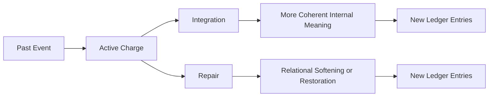

# Integration and Repair

This page explains how emotionally charged material becomes more coherent, stabilized, or relationally repaired.

## Purpose

Describe how the architecture handles recovery, reorganization, and the reduction of destabilizing impact over time.

## Core Idea

Not every change in emotional state comes from simple decay. Some changes come from deeper reorganization. Integration is the process by which emotionally charged material becomes more coherent and less destabilizing. Repair is the process by which relational damage is softened, acknowledged, or restored through later events or changed understanding.

These processes are essential because time alone does not solve everything.

## Visual Overview

## Integration

Integration is what happens when the system can hold a past event in a more stable and coherent way. The event remains part of history, but it no longer produces the same level of destabilizing activation.

Integration may result from:
- time and reduced activation
- reflection
- pattern understanding
- improved expectation calibration
- changed self-state
- insight

Integration is not erasure. It is reorganized meaning.

## Repair

Repair is more specifically relational. It occurs when later events, acknowledgments, apologies, consistency, or changed behavior soften the damage created by earlier events.

Repair may affect:
- trust
- warmth
- caution
- perceived sincerity
- repairability
- general stress tied to the relationship

Repair does not need to fully restore a prior state. Partial repair is still meaningful.

## Why These Two Must Be Distinguished

Integration can happen without an external counterparty doing anything new. It may result from internal reflection and reorganization.

Repair often depends on later relational evidence, such as:
- apology
- changed behavior
- acknowledgment
- consistent care after harm

Both can reduce present distress, but they are not the same process.

## Example

A painful comment may become more integrated over time as the system understands it with greater nuance. A different event may remain painful until the counterparty later acknowledges harm and behaves differently. The first is mainly integration. The second is mainly repair.

## Relationship to the Ledger

Both integration and repair should produce new effects through new ledger entries rather than rewriting the original ones. This preserves:
- original impact
- later change
- current derived state

## Why This Matters

Without integration and repair, the architecture would either:
- remain trapped in old impacts
or
- rely too heavily on simple decay

This page defines the deeper mechanisms that allow growth without historical dishonesty.

## Design Rule

Integration and repair should reduce destabilizing influence by adding new meaning, not by erasing prior records.

## How It Connects

The next page, **Cross-Relationship Spillover**, explains how local relationship effects can alter the general self-state and later interactions with others.

---
**Previous:** [Reflective Adjustments](30-reflective-adjustments.md)  
**Next:** [Cross-Relationship Spillover](32-cross-relationship-spillover.md)  
**Related:** [State Resolver](21-state-resolver.md), [Relationship State](08-relationship-state.md), [Health and Adaptiveness Criteria](36-health-and-adaptiveness-criteria.md)
