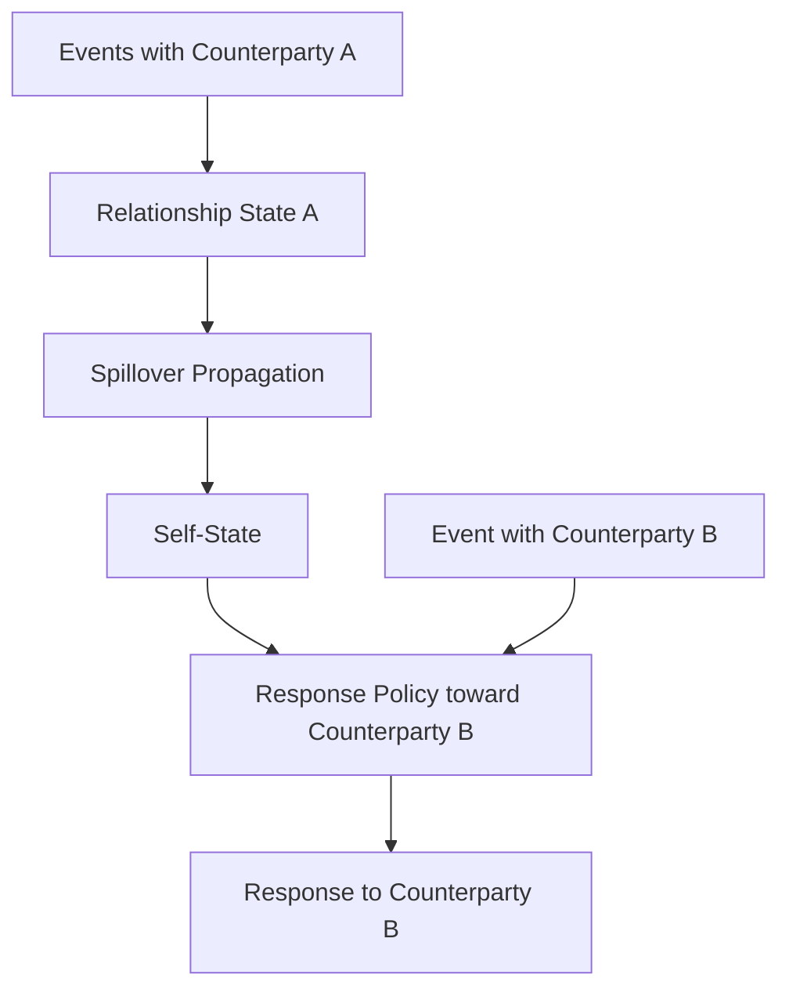

# Cross-Relationship Spillover

This page explains how one relationship can influence the general self-state and later interactions with other counterparties.

## Purpose

Show how relationship-specific events can become broader system-wide influences without losing causal traceability.

## Core Idea

Cross-relationship spillover is the process by which effects that begin inside one relationship state propagate into the self-state and then shape later interactions with other counterparties. It is one of the main reasons the architecture needs both local relational state and global self-state.

Without spillover, the system would treat each relationship as isolated. With spillover, the system can represent the fact that meaningful interactions in one relationship can affect the system more broadly.

## Visual Overview

## Why Spillover Matters

A difficult interaction with one counterparty may:
- increase general stress
- reduce general openness
- raise caution
- increase defensiveness
- alter expectation formation with others

A positive interaction may:
- increase calm
- restore confidence
- increase warmth
- reduce defensive readiness

These changes may later influence how the system responds in a different relationship even when that other counterparty did nothing to cause the shift.

## Local Effect vs Global Effect

The architecture should distinguish clearly between:

### Local relational effect
A change that belongs primarily to one relationship state.

### Global effect
A change that belongs to self-state and can affect later interactions more broadly.

For example:
- “I trust counterparty A less” is local
- “I am more cautious overall right now” is global

This distinction is critical for explanation.

## Why Spillover Should Be Explicit

If spillover is implicit or hidden, later behavior may become difficult to explain. The system must be able to say:
- which relationship produced the original effect
- what part of that effect propagated into self-state
- how that global shift later influenced another interaction

This is what makes spillover understandable rather than arbitrary.

## Spillover Does Not Mean Misattribution

If counterparty A raises general stress, and the system later responds more cautiously to counterparty B, the architecture should not imply that B caused the caution. It should preserve the causal chain:
- A caused relationship-level impact
- relationship-level impact propagated into self-state
- self-state shaped later behavior with B

This distinction protects fairness and traceability.

## Example

Suppose repeated dismissal from counterparty A lowers trust in that relationship and also raises general stress. Later, when counterparty B sends an ambiguous message, the system may interpret it more cautiously because self-state is already stressed. The caution toward B is real, but its deeper cause lies in earlier events involving A.

## What Spillover Can Affect

Spillover may influence:
- response tone
- patience
- warmth
- interpretive caution
- expectation calibration
- willingness to repair
- general trust in others

Some effects remain local. Others are strong enough to become global.

## Design Rule

Spillover should be modeled as a traceable propagation from relationship state into self-state, not as an unexplained global mood shift.

## How It Connects

The next page, **Response Policy**, explains how current state is translated into outward communication behavior.

---
**Previous:** [Integration and Repair](31-integration-and-repair.md)  
**Next:** [Response Policy](33-response-policy.md)  
**Related:** [Self-State](06-self-state.md), [Relationship State](08-relationship-state.md), [Explainability and Auditability](34-explainability-and-auditability.md)
