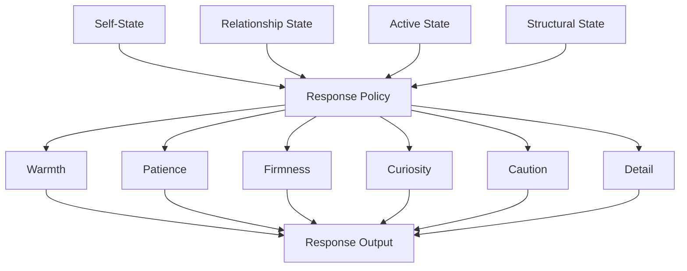

# Response Policy

This page explains how the system turns current state into outward behavior.

## Purpose

Define the layer that converts derived internal state into communication style and behavioral tendencies.

## Core Idea

Response policy is the behavioral control layer that translates current active state and structural context into outward communication choices. It is where the architecture turns internal processing into visible behavior.

The response policy does not generate emotion. It expresses the consequences of emotion, expectation, relationship state, and self-state in a bounded and interpretable way.

## Visual Overview

## Why Response Policy Matters

Without a response policy layer, the architecture would describe internal state but not explain how that state affects actual interaction. The model needs a controlled way to map:
- active state
- structural state
- relationship state
- current event context

into response tendencies such as:
- warmth
- patience
- firmness
- curiosity
- caution
- detail
- openness
- emotional validation

## Internal State vs Outward Behavior

The architecture should not assume that internal emotion maps directly and literally into behavior.

For example:
- elevated anger does not need to produce hostility
- elevated caution may produce shorter and more careful responses
- elevated warmth may produce greater patience and validation
- elevated stress may reduce openness and effort

This allows the system to stay interpretable without becoming theatrically emotional.

## What Response Policy May Control

Response policy may shape:
- tone
- level of detail
- pace of explanation
- emotional warmth
- directness
- boundary firmness
- tolerance for ambiguity
- willingness to ask questions
- degree of reassurance
- degree of challenge

These are behavioral settings rather than raw feelings.

## Why Bounded Translation Matters

The response policy should be constrained. The system may model strong internal reactions, but the outward response still needs to remain coherent and usable.

This means response policy is not simple emotional mirroring. It is a structured expression layer shaped by design rules.

## Example

If the system has:
- elevated caution
- moderate stress
- low trust in the current relationship

the response policy may shift toward:
- more direct language
- less warmth
- tighter boundaries
- lower interpretive generosity

If the system has:
- high warmth
- high trust
- low stress

the response policy may become:
- more patient
- more expansive
- more validating
- more curious

## Why This Improves Explainability

Response policy helps the system explain:
- why a response became shorter
- why tone became firmer
- why more caution appeared
- why warmth increased

This is essential if the system is expected to account not only for how it feels, but also for how that feeling changed behavior.

## Design Rule

Response policy should express state in a bounded, interpretable way. It should not collapse internal state directly into unconstrained emotional performance.

## How It Connects

The next page, **Explainability and Auditability**, explains how the architecture accounts for its own states, transitions, and responses.

---
**Previous:** [Cross-Relationship Spillover](32-cross-relationship-spillover.md)  
**Next:** [Explainability and Auditability](34-explainability-and-auditability.md)  
**Related:** [State Resolver](21-state-resolver.md), [Self-State](06-self-state.md), [End-to-End Processing Flow](35-end-to-end-processing-flow.md)
