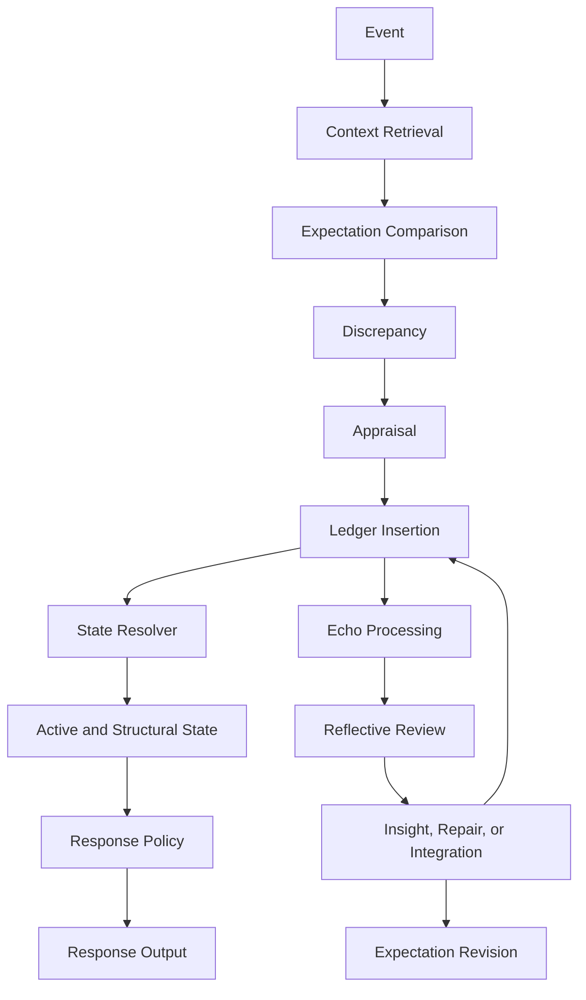

# End-to-End Processing Flow

This page walks through the full lifecycle of processing in the architecture.

## Purpose

Show how the major concepts and processes connect from initial event intake to later reflection, response, and revision.

## Core Idea

The architecture is not just a set of concepts. It is a flow. A meaningful event enters the system, is processed against context and expectation, produces discrepancy, receives appraisal, generates ledger entries, influences current state through the resolver, shapes response policy, and may later be replayed through reflection, insight, repair, or integration.

This page gives a top-level view of that lifecycle.

## Visual Overview

## Flow Overview

### 1. Event occurs
A discrete event enters the system. It may come from external interaction or from internal reflective processing.

### 2. Context is retrieved
The system retrieves the relevant:
- self-state
- relationship state
- event history
- active expectations
- recent patterns

### 3. Actual outcome is identified
The system determines what happened in the event.

### 4. Expectations are compared with outcome
The system compares the actual outcome with:
- predictive expectation
- desired outcome
- deserved outcome

### 5. Discrepancy is calculated
The gap between expectation and outcome is measured.

### 6. Appraisal assigns meaning
The system interprets what the discrepancy means for self, relationship, or situation.

### 7. Emotional impact is generated
The appraised discrepancy produces consequences for self-state, relationship state, or both.

### 8. Ledger entries are inserted
These consequences are written into the append-only emotion ledger.

### 9. Current state is resolved
The state resolver reads history and computes present active and structural state using:
- decay
- persistence
- reinforcement
- unresolvedness
- reactivation
- repair
- integration

### 10. Response policy is derived
The current state is translated into behavioral controls such as warmth, firmness, patience, and caution.

### 11. Response is generated
The system responds outwardly according to the response policy.

### 12. Reflection may occur later
Past material may later be replayed through echo processing and structured reflection.

### 13. Insight, repair, or integration may occur
Later processing may produce new understanding, repair, or reorganization.

### 14. New ledger entries are added
These later changes are also recorded in the ledger.

### 15. Expectations and structure may be revised
The system updates what it expects and how it relates to the counterparty and to future events.

## Why This Flow Matters

The value of the architecture comes from the fact that these stages remain connected. The system does not simply jump from input to output. It preserves the path.

That path is what makes the model:
- explainable
- auditable
- persistent
- revisable without historical rewriting

## Example in Brief

A counterparty fails to acknowledge a meaningful effort.

The system:
- expected acknowledgment
- wanted acknowledgment
- believed acknowledgment should happen
- experiences discrepancy when silence occurs
- appraises the silence as dismissal
- records hurt, reduced trust, and higher caution in the ledger
- resolves these effects into current state
- responds more cautiously
- later replays the event after a repair attempt
- softens the original interpretation through insight
- records that change without erasing the earlier hurt

This is the architecture in motion.

## Design Rule

The full flow should remain causally connected from event to state to response to later reinterpretation.

## How It Connects

The next page, **Health and Adaptiveness Criteria**, defines what counts as better processing inside this architecture.

---
**Previous:** [Explainability and Auditability](34-explainability-and-auditability.md)  
**Next:** [Health and Adaptiveness Criteria](36-health-and-adaptiveness-criteria.md)  
**Related:** [Concepts and Processes Inventory](03-concepts-and-processes-inventory.md), [Core Architectural Principles](04-core-architectural-principles.md), [Response Policy](33-response-policy.md), [Visualization Index](visualizations.md)
